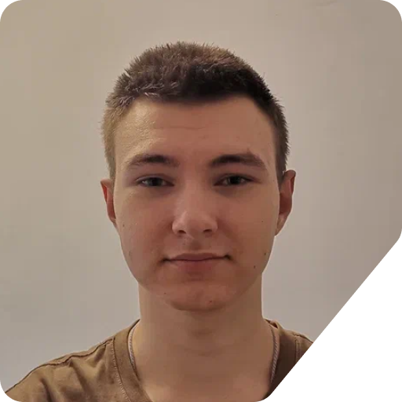

Hi there! I'm Egor: A 17 years old student and Begginer Backend Developer. This is my profile page to share my personal works and projects that I am working on.

###

↙️ This is my work, but I backend developer.

 

I am a 17-year-old student and a begginer backend developer, I live in Volgograd, Russia. I started learning programming in 2023. The first programming language I started learning was C#. And it's still one of my favorite programming langs.

 
 
 

I would like to create something that will please me and other people, as well as benefit them. I want to work in a team of professionals who are really passionate about their business.

So far, I have not worked anywhere as a backend programmer, but I am gradually striving for this.

Lately, I've been actively studying Java and trying to keep an eye on my github so that it doesn't break the eyes of other people.

 

###

  
  
  
  
  
  
  
  
  
  

###

  
  
  
  
  
  
  
  
  
  
  
  
  
  
  

 
 
 

###

